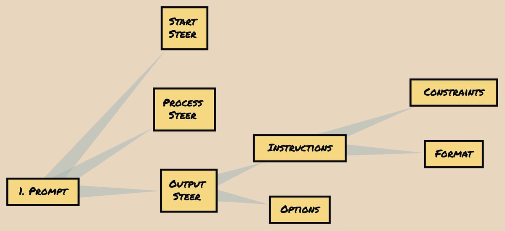
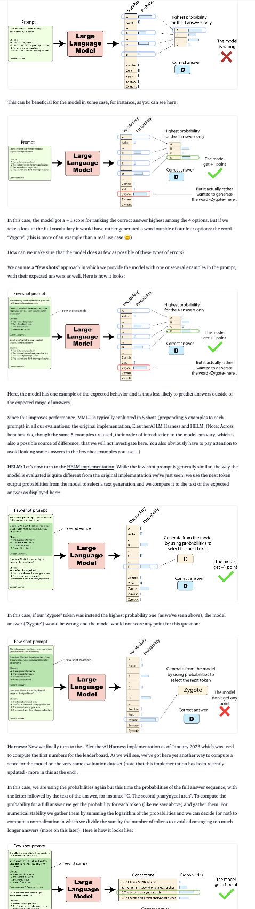
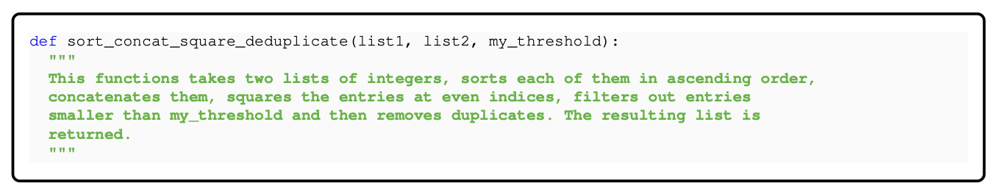
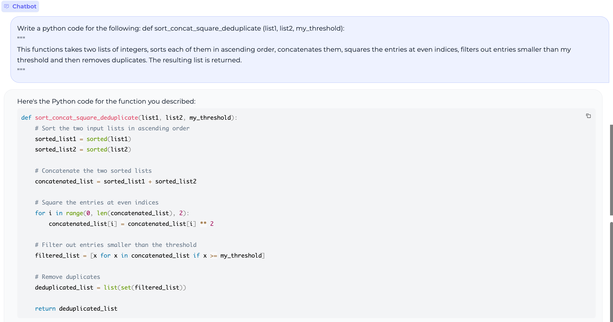
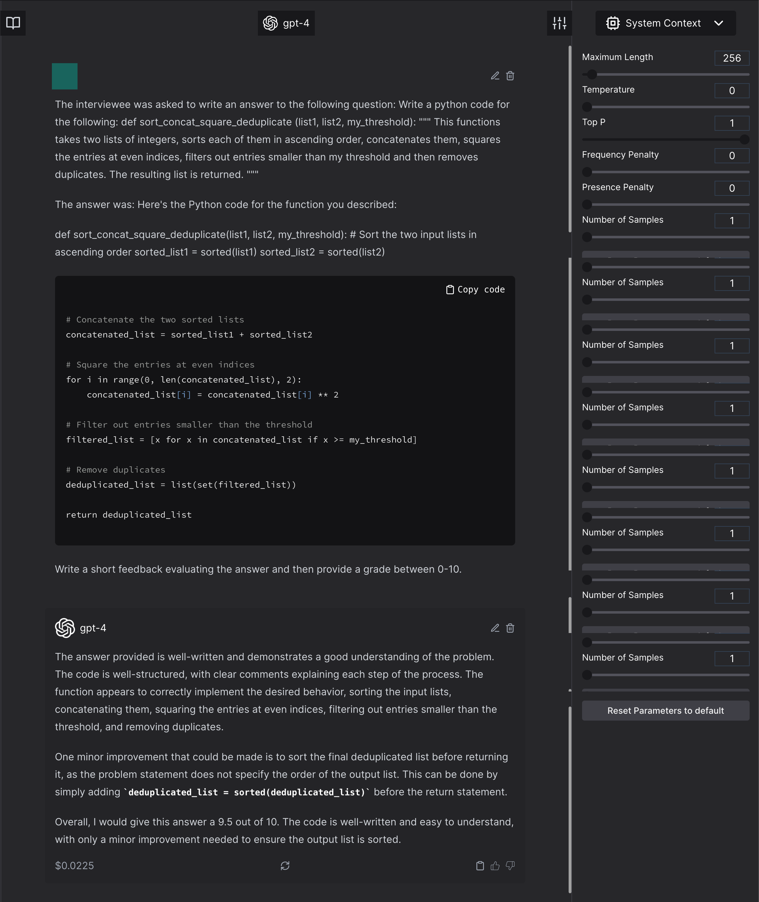
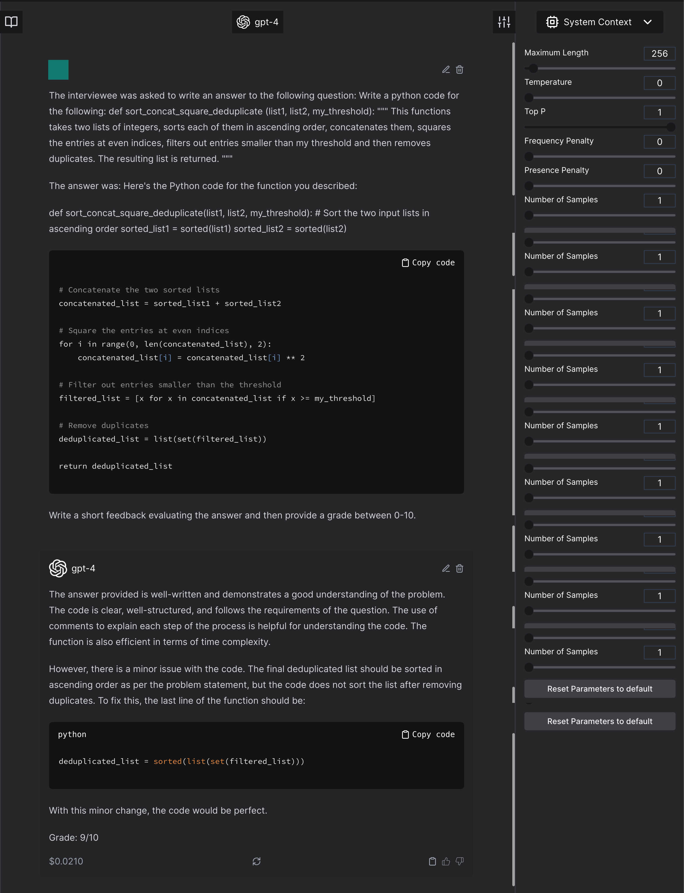
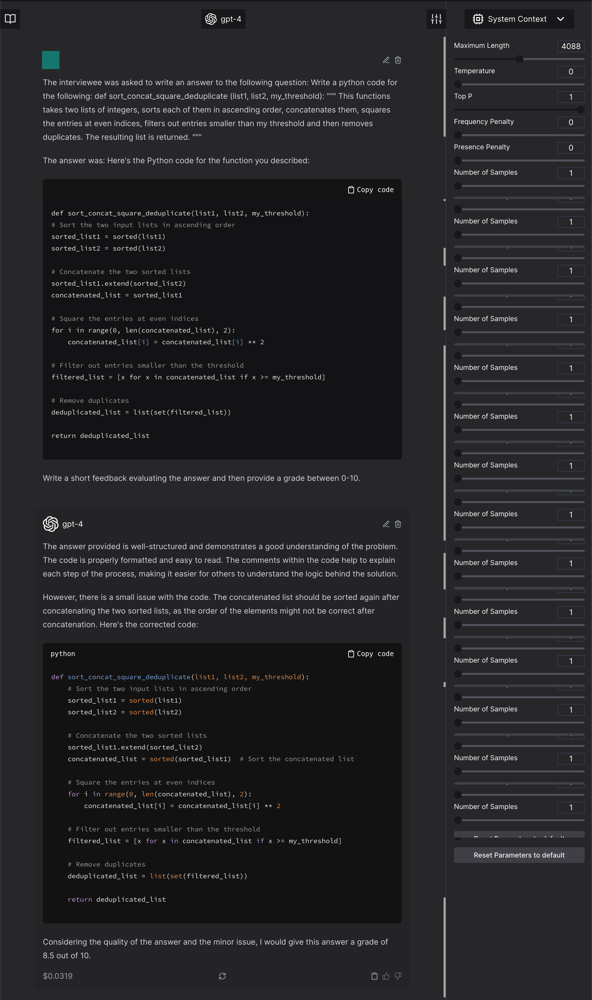
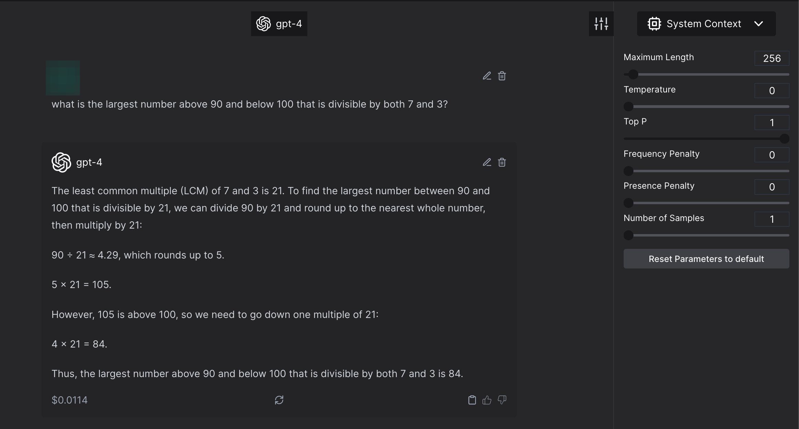
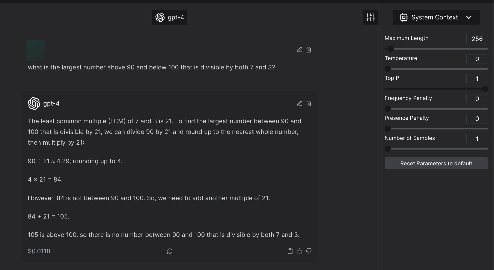
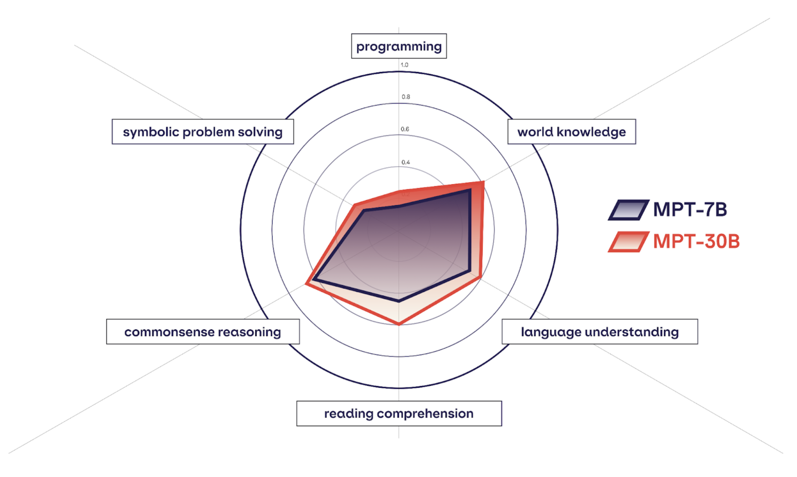

---
categories:
- Text
- Evaluation
- Metric Design
- Opinion
- Foundation Models
citation-location: margin
date: '2023-06-25'
description: ''
display-date: 'Jun 2023'
filters:
- collapse-social-embeds
- lightbox
format: html
lightbox: auto
reference-location: margin
threeword: 'Missing Missing Evaluations'
title: The Curious Case of LLM Evaluations
---


# Introduction

Every popular paper later, we keep coming back to the same questions: how do we know that this is a good evaluation?

> *Note*: While this document will be updated with references in time; I am not claiming all of the ideas here are my own. They are of course inspired and based off many other research outcomes I trust; and I will slowly come around to include them here.

And unfortunately, the answer is not as simple. I might even go as far to say; it --- in most likelihood is not solid. We might want it to be, but evaluation and benchmarking had already been complicated, even for classification models. We, honestly never solved it for small generative models and long form generations; and then suddenly we were faced with an influx of extremely large, multi-purpose language models; aka; foundation models.

And now everyone is left with these carefully curated academic datasets that they report numbers on; that in all likelihood leaked into the training set when the whole accessible internet was scraped for it; and; buggy techniques; because we as ML practitioners were never taught basic statistics.

# Common Problems with Evaluation in Machine Learning

Evaluation always come with the basic issues. I am writing this document with the assumption that everyone just assumes these evaluation issues anyway; because they existed in previous machine learning models too.

### Leakage

Data leakage from the test datasets into the training set. This is specifically true for LLMs where the details of the dataset are often missing; and sometimes proprietary.

### Coverage

Coverage issues of the test samples. The evaluation datasets often do not have a diverse coverage of all various ways that a particular task can be evaluated. These might end up reflecting as accuracy problems, variability problems, efficient sample size problems or robustness problems.

### Spurious Correlations

Spuriously correlated or duplicated test samples. The evaluation sets for many tasks have been shown to have a "shortcut" solution. So, while the assumption might be that the test sample is a good representative evaluation of the task, it often might end up not being the case.

### Partitioning and phrasing

Evaluation dataset splits are hard to deal with. Many evaluation datasets come with a different implementation of the same problem. They might also lead to unintentional leakage. For example, in human centered tasks; it is often the case that the evaluation dataset is not isolated for user and rather split just on samples.

:::{.twitter user=MaartenBosma status_id=1672349512499867648}

:::

### Random seed

Any neural network output is usually slightly dependent on the random seed. Any singular inference run based reporting could lead to misinformed results and paint an unclear picture of the situation.

### Precision vs Recall Tradeoff

While many people are content with reporting accuracy results, it has been well known that the impact of false positives vs false negatives isn't the same for every task. If you are using an ML model for IR, and see a false-positive or miss a false-negative; it is probably alright. If you are using the same model for passive health monitoring, a false negative is heavily

# Issues with Evaluation wrt LLMs

Now that we have that information, let's talk about the components of LLM evaluation. You can breakdown any LLM evaluation into 6 components:

## Evaluation Datasets

Evaluation Datasets: These are the test samples that the model is being evaluated for. There are multiple ways to construct these evaluation datasets and to use them; each of them coming with its own set of problems.

Using the similar set of datasets for evaluation come with a another set of problems:

-   Fuzziness in prompts: Now that there are prompts involved in the process; we really need to consider the fuzziness that comes from the prompt itself. While the evaluation datasets were used without any "instruction language" or "prompted addition", the test samples at least remained consistent. The prompts here may not.
    I talk more about prompt introduced variability in my other post about prompt based benchmarking. It specifically talks about three components of a prompt for standardizing prompt based evaluation: prompt steer, sample steer, output steer. You can read it here \[TODO\].

    ::: {.column-margin}

    

    :::
-   Untraceability: Going back to the point of [data leakage](/3f50a6e3dbed45f988ef288e0f0d6734#4c9e61e62b184efda1c249fd3bab0a6e); while it used to always be a problem; now that no one has any idea about any of the data that went into the model, even the best-faith and triple checked evaluation has no guarantees of being a out of distribution evaluation.

### What can these evaluation datasets look like? {#what-can-these-evaluation-datasets-look-like-}

-   Pre-curated datasets from various standardized tests --- These are mostly designed to be differentiating for humans and not for models. Additionally, they can have memorization based questions, that can incorrectly be inferred as understanding in context of evaluating LLMs.
-   Human curated tests for the sole purpose of evaluating a task --- These test sets are usually designed as a measure against data leakage. After all, humans can probably create a distinct enough pattern to evaluate against. While that is a pro, these datasets come with flaws of their own; for example they are really small and, do not usually have
-   Ad-hoc testing samples by humans --- These are performed as conversation based evaluation of these models. While they are most likely to be accurate; they are are biased by the mere idea that the human usually needs to know the solution to the problem to be able the question for evaluation purposes. This often ends up in; what I call as; `human imagination collapse` or the likelihood that an individual human would often be set on a trajectory to test for and not meaningfully diversify; at least in a single setting.

::: {.column-margin}

 by [**Subbarao Kambhampati (కంభంపాటి సుబ్బారావు)**](https://twitter.com/rao2z)](images/case_of_llm_evals/The_Curious_Case_of_LLM_Evaluations-0fc2f888363.png)

:::

## Model Output

Now let us come to the second problem --- output from generative models.

-   One of the major problems with almost every single solution that we, as a community have proposed: is this idea of evaluating generative models using discriminative outputs.
-   Model output is heavily dependent on the (a) prompt asked for the output; and (b) the answers asked for. For example, if you ask a model for a label 0 or 1; vs asking a model for labels in words (for example: spam or not spam); you might end up with different outcomes.
    Another example: asking a model for a direct output and extracting the answer can lead to a different answer than in the multiple-choice scenario.
-   Regression based model outcome does not necessarily scale and hence can change the standard deviation and mean of the regressed output. For example, if you ask a model to provide a graded rating between 0-10; you cannot with certainty scale that grading to 0-1, especially if you care about significance testing.

## Sample/Output Transformation {#sample-output-transformation}

There are many transformations applied to model outputs or their inputs. These can roughly be divided into 4 categories:

-   Looped Transformations: Loop based transformations usually follow the philosophy of ---\> what if we additionally add the model output + some form of evaluation of the current answer back into the model; such that it eventually reaches the perfect outcome. Some examples of these would be Self-Critique models.
-   Chained Transformations: Chain based transformations usually do not have a measured evaluation in between a set of model input → output → model input and so on. These chains are usually pre-defined and have a restricted number of paths to follow.
-   Atomic Outputs: This method involves breaking down the output of a model; either manually, through a rule based system or through AI itself; into atomic components that can be evaluated individually to combine to form a larger weighted grade.
-   Constrained Output: This method involves either using log probability (which isn't accessible in case of GPT3.5/GPT4 APIs) or other internal constraints to ensure that the model responds with tokens belonging to a certain pre-decided or allowed distribution.

## Ground Truth

This does not need much explanation but there are certain aspects to remember here; especially when you think of ground truths in respect to present scene of evaluation. Firstly, ground truth can be biased, ambiguous, or have a high range of disagreement. In case of human centered tasks, such as likability of a prose, the disagreement is often averaged out rather than considered as an annotation curve, you need to compare the model's outcome multiple times to achieve a true distribution comparison.

With new evaluation practices, you need to remember that you may or MAY NOT have ground truth in a certain evaluation.

Remember the 3 possible pitfalls with ground truth:

-   Inclusion in the loop or chain based transformations
-   Inclusion in in-context or few shot learning examples in case of prompt steering
-   Ground truth might be used to establish correlation between the newly proposed completely automated metric; and not actually used in evaluation.

## Evaluation Medium

In my perspective, the evaluation medium can be categorized into three distinct groups.

### Direct Evaluation Metrics: {#direct-evaluation-metrics-}

The first category I call \"direct evaluation metrics.\" These are the traditional metrics that have been widely used in the field for a long time. Metrics like accuracy and F1 score fall into this category. Typically, this approach involves obtaining a single output from the model and comparing it to a reference, either through constraints or by extracting the desired information. The evaluation can be done through ad-hoc conversation-based evaluation, curated specialized test sets, or direct annotation.

For instance, one direct evaluation metric is comparing the model\'s accuracy directly to the ground truth. When evaluating multiple-choice question answers, the comparison can be based on matching the choice letter, the complete choice, or the distribution over choices. To gain a deeper understanding of how these evaluation approaches can impact the results, check out this article: [What\'s going on with the Open LLM Leaderboard and Llama?](https://huggingface.co/blog/evaluating-mmlu-leaderboard)

::: {.column-margin}



:::

### Auxiliary models-based evaluation

Moving on to the second category, we have \"indirect heuristics.\" Here, we utilize smaller models, whether they are fine-tuned or raw decompositions, to evaluate the answers generated by the main model. The idea is to leverage these smaller models, which excel at specific tasks that large language models are generally good at, such as adjective identification or polarity identification. The outputs of these smaller models act as weak scores that are combined to provide a final label or evaluation for the generated output. This indirect evaluation approach allows for a more nuanced assessment of the model\'s performance, particularly in areas like the likability of prose. Although these models introduce some variability, it\'s important to note that they are often trained for regression tasks and fine-tuned for specific purposes.

### Model-Driven Evaluation

The third category I refer to as \"model-driven evaluation.\" In these cases, the model itself provides the final score or evaluation. However, this introduces an additional layer of variability. Even if the model has access to ground truth information, the evaluation metric itself may introduce randomness or variability in the scoring process. For example, a common evaluation question could be: \"Is this generated output (O) similar to the ground truth answer (G)?\" The answer to this question not only depends on the randomness associated with the model\'s output but also on the inherent variability of the evaluation metric.

It\'s important to remember that recent evaluation practices may involve the inclusion or exclusion of ground truth in model-driven evaluation.

This can lead to 2 kinds of model-driven evaluations:

-   \[Inclusion of Ground Truth\] Asking the model to compare to the ground truth and produce an output in affirmation or contradiction. This can also be seen as providing two statements to the model, and asking it to label them for entailment, paraphrasing or both.
-   \[Exclusion of Ground Truth\] Asking the model to directly "judge" the output. In this case, the larger model is often provided outputs from the smaller models and asked to evaluate the answer's correctness. This can range from a short feedback to a likert scale answer or anywhere in between.
    > Note, that the larger model evaluating the smaller model paradigm might not necessarily hold for all papers and is significantly more dubious in claims than the former.

The general explanation provided for such situations is --- but oh, this is how humans do this stuff too. So, we are asking GPT-4 to be more humane and avoiding binary labels that we needed initially.

For example, this is why the authors of [Textbooks are all you need](https://arxiv.org/abs/2306.11644) believe this is a correct method of evaluation.

:::{.twitter user=EldanRonen status_id=1673107981742010370}

:::

::: {.callout-tip collapse=\"true\" title="Detailed account of why I believe that using GPT-4 as a judge is incorrect in this case"}

But this, in my opinion, is not a correct way to account for non-binary labels. Especially in coding, when there is an existing method to run the function through tests and have assertions against expected answers. My judgement might have been different had this evaluation method been proposed for a subjective task, but coding, is both, an objective and assertable task, and this evaluation method discards all these properties of a coding task in general.

Let's break this down:

What are the problems that general evaluations in coding have? The biggest problem is (a) writing representative tests and their expected output, and, (b) making sure that these tests are comprehensive and follow a curriculum based evaluation.

That is a bunch of jargon! What does this even mean?

For example, let's take the example in their paper:

:::{.column-margin}



:::

``` python
Write a python code for the following:
def sort_concat_square_deduplicate (list1, list2, my_threshold):
"""
This functions takes two lists of integers, sorts each of them in ascending order, concatenates them, squares the entries at even indices, filters out entries smaller than my threshold and then removes duplicates. The resulting list is returned.
"""
```

One of the major drawbacks of existing evaluation datasets is that they test the final answer. While the authors claim that it is a better idea to judge if the model implements components correctly.

Going back to decomposed testing, the correct way here would be to ask the model to provide atomic functions and then evaluate those atomic functions using tests and the final function, which calls the atomic functions in desired order.

This solves the problem of not having binary pass/fail labels. This of course requires more effort, but is substantially more accurate.

Doesn't GPT4 as a judge solve these problems anyway? No, no it does not.

Why not?

-   The method does not provide the exact same number every single time. For example, let's consider the same doc string as mentioned above. And let's evaluate how good Mosaic 30B-Chat is good at programming.
    

    Now, let us ask GPT4 to judge this. Not only the answer changes, the model suggests to do something that was not even asked for.

    

    
-   Implicit assumption that the model actually scores completely incorrect answer at 0. This assumption is not tested by the authors. Let's test it. The decomposition of this problem is into 6 atoms:
    -   Sorting of 2 lists ⟶ Sort second list in reverse order
    -   Concatenation ⟶ Change to duplicate concatenation
    -   Even Indices ⟶ Change to every index
    -   Square ⟶ Change to power 2.2
    -   Threshold Filter ⟶ Change it to filter to less than or equal to
    -   Remove Duplicates ⟶ Duplicate the filtered list

    GPT4 judges it to be 4/10. And, it does not see that the threshold value was changed.

    
-   Anything weird to the model, that is not in the general expected distribution will be marked low. For example, here is a correct code that is marked lower just because it is unexpected by GPT4.
    
:::

## Performance Report

In the realm of evaluation, it is vital to consider how we present the performance metrics. These numbers can be influenced by various factors, such as dataset splits and slight variations. It would be ideal to conduct multiple tests for each sample, utilizing different prompts and samples. However, this approach can be resource-intensive and necessitate significant modifications to evaluation frameworks. Therefore, it is crucial to approach the reported numbers with caution and maintain a level of skepticism.

If you have been involved in the machine learning field prior to the rise of large language models like GPT, you might recall the practice of running each test sample multiple times with various randomly seeded models. However, due to the lack of control over seed during inference in GPT models, it is advisable to run tests at least three times. Reporting the mean and standard deviation becomes essential for properly interpreting the significance of the results. While p-values can be messy, it is even more problematic to claim significant improvement based on a few points difference and a single inference result.

:::{.column-margin}

Two back to back answers from GPT4, temperature set to 0, about finding a largest number above 90 and below 100 that is divisible by both 7 and 3.

> Click on images to expand them.





:::

Another aspect to consider is the level of granularity in reporting. Many academic datasets already suffer from various issues, and the problem is further exacerbated by averaging values across these large multi-task datasets without considering the specific evaluation goals of each test sample. Currently, most reports lack granularity even at a high-level task-based assessment, let alone sample-based granularity.

Mosaic 30B (released on 2023-06-22) explores the idea of combining benchmarks into thematic groups.

:::{.column-margin}



:::

Lastly, we must address the concept of prompt-fine tuning. Numerous research papers present results on the test set by identifying the best prompt for a given task. While this approach may seem reasonable in theory, it fails to provide a reliable measure of the model\'s performance when it comes to solving real-world problems encountered by average users. If the intention is to use the prompt as an auxiliary component in a pipeline, then finding the optimal prompt for the task and model is acceptable. However, for direct user-facing end-to-end models, it is crucial to acknowledge that the best prompt for obtaining the correct answer may not be realistic or feasible for all users, especially in the case of general-purpose models.

::: {.twitter user=ArmenAgha status_id=1669098472493162497 }
:::

> **Side note:** There is a proposal of encrypting and encoding prompts and evaluation. And I completely support that proposal. While in an ideal world we might want opt-in for data, this isn't the case at the moment, and we can safeguard ourselves from train-test leakage concerns.
>
> I have lost this paper in my never-ending pile. If someone finds this paper, please let me know and I will edit this document.

# tl;dr {#tl-dr}

In the realm of evaluating language models (LLMs), we find ourselves grappling with intricate questions about the reliability of our assessments. The truth is, evaluation and benchmarking have always been challenging, and the advent of large, multi-purpose models has only compounded the complexities. Issues such as data leakage, coverage limitations, spurious correlations, and partitioning quandaries plague our evaluation practices. To make matters worse, precision vs. recall tradeoffs and the lack of ground truth further muddy the waters. This post explores the common problems with evaluation in machine learning and delves into the specific challenges posed by LLMs. We categorize evaluation mediums into direct metrics, auxiliary models-based evaluation, and model-driven evaluation, shedding light on the nuances of each approach. With a cautious eye, we navigate the intricacies of reporting performance numbers and emphasize the importance of granularity. Prompt-fine tuning is also scrutinized, reminding us to consider the realism of user interactions. As we venture deeper into the evaluation landscape, it becomes clear that a comprehensive understanding of these complexities is essential for meaningful assessments of LLMs.
